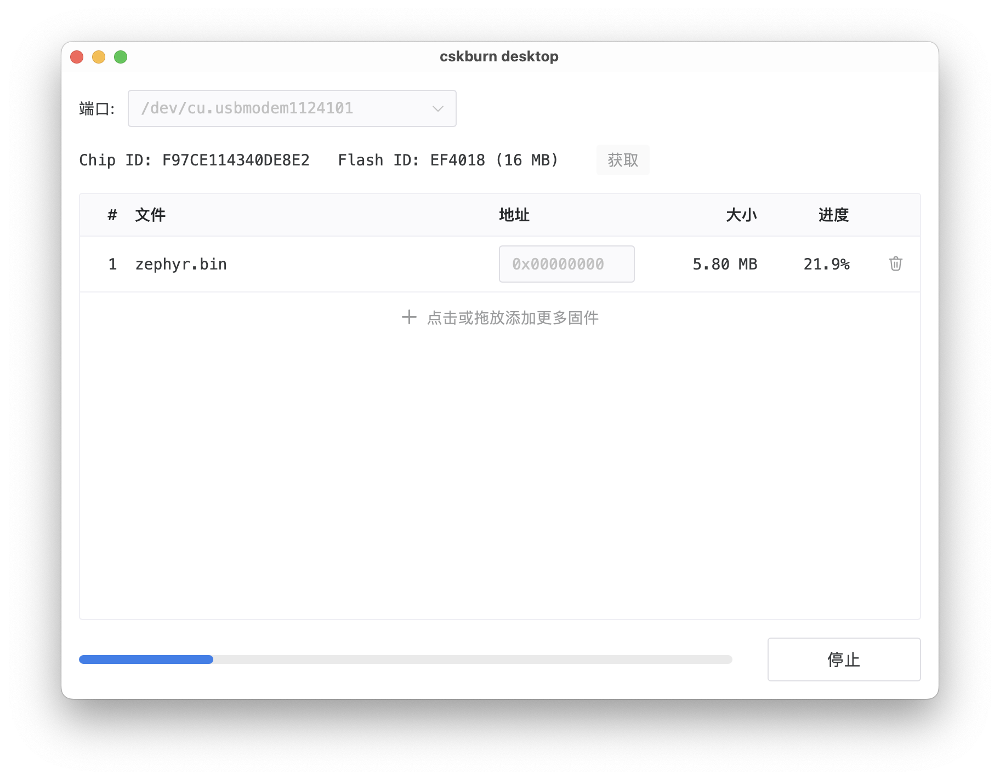

cskburn-desktop
===============

[![release][release-img]][release-url] [![downloads][downloads-img]][downloads-url] [![license][license-img]][license-url] [![issues][issues-img]][issues-url] [![stars][stars-img]][stars-url] [![commits][commits-img]][commits-url]

聆思 CSK 系列芯片桌面烧录工具。



## 系统要求

* Windows：10 或以上
* Linux：Ubuntu 22.04 或以上
* macOS：13.0 (Ventura) 或以上

## 安装

从 [Releases](https://github.com/LISTENAI/cskburn-desktop/releases) 根据所用操作系统选择对应版本下载。

#### Windows

下载 `cskburn-desktop_windows-x86_64-setup.exe` 双击安装即可。

#### Ubuntu

Linux 平台提供 `x86_64` 和 `aarch64` 两种架构的安装包，可根据需要选择。

```bash
sudo apt install --fix-broken cskburn-desktop_linux-x86_64.deb
```

你还需要为设备赋予读写权限。在终端执行 `sudo gedit /etc/udev/rules.d/99-cskburn.rules`，在弹出编辑器中输入以下内容：

```
SUBSYSTEMS=="usb", KERNEL=="ttyACM[0-9]*", MODE="0666"
SUBSYSTEMS=="usb", KERNEL=="ttyUSB[0-9]*", MODE="0666"
SUBSYSTEM=="usb", ATTR{idVendor}=="0483", ATTR{idProduct}=="0adb", MODE="0666"
```

保存并关闭编辑器，重新插拔设备即可。

#### macOS

Mac 平台提供 `x86_64` (Intel) 和 `aarch64` (Apple Silicon) 两种架构，可根据需要选择。

1. 下载 DMG 并打开，将 `cskburn desktop.app` 拖入到 Applications 目录
2. 打开 Applications 目录找到 `cskburn desktop.app`，点击右键菜单的「打开」，在弹出的对话框中选择「打开」

如果启动应用时提示损坏，可尝试在终端中执行下面命令：

```bash
sudo xattr -r -d com.apple.quarantine '/Applications/cskburn desktop.app'
```

## 开发

所需开发环境：

* [Rust](https://www.rust-lang.org/) >= 1.78.0
* [Node.js](https://nodejs.org/) v20 (LTS)

```bash
npm install
npm run tauri dev
```

主要使用了以下开源项目：

* [Tauri 2.0](https://v2.tauri.app/)
* [Naive UI](https://www.naiveui.com/)
* [Vue.js](https://vuejs.org/)
* [Vite](https://vitejs.dev/)

## 协议

[Apache-2.0 License](LICENSE)

[release-img]: https://img.shields.io/github/v/release/LISTENAI/cskburn-desktop?style=flat-square
[release-url]: https://github.com/LISTENAI/cskburn-desktop/releases/latest
[downloads-img]: https://img.shields.io/github/downloads/LISTENAI/cskburn-desktop/total?style=flat-square
[downloads-url]: https://github.com/LISTENAI/cskburn-desktop/releases
[license-img]: https://img.shields.io/github/license/LISTENAI/cskburn-desktop?style=flat-square
[license-url]: LICENSE
[issues-img]: https://img.shields.io/github/issues/LISTENAI/cskburn-desktop?style=flat-square
[issues-url]: https://github.com/LISTENAI/cskburn-desktop/issues
[stars-img]: https://img.shields.io/github/stars/LISTENAI/cskburn-desktop?style=flat-square
[stars-url]: https://github.com/LISTENAI/cskburn-desktop/stargazers
[commits-img]: https://img.shields.io/github/last-commit/LISTENAI/cskburn-desktop?style=flat-square
[commits-url]: https://github.com/LISTENAI/cskburn-desktop/commits/master
